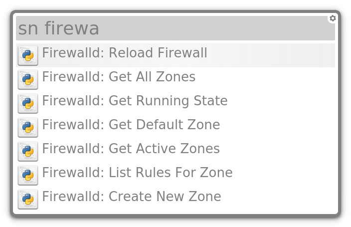

# Alfred2Albert Snippets

All the credit for this goes to [dynobo's SnippetStore](https://github.com/dynobo/SnippetStore). I am trying to make the switch from Mac to Linux and Alfred's Snippets are a major part of my productivity. I found dynobo's SnippetStore extension and was impressed by his great work. I was able to modify his extension to work with Alfred's Snippets, which will help in my transition.

This extension allows you to use Alfred's snippets, but it cannot add/edit/delete snippets. For now, this should still be done upstream on your Mac directly with Alfred. Changes will then sync to Dropbox (or Nextcloud etc) and update in Albert.

I am using Alfred v3 and have not tested with Alfred v4.

## Installation
1) Download `alfred2albert-snippets.py` to one of Albert Launcher's folders for python extensions:
- ~/.local/share/albert/org.albert.extension.python/modules
- /usr/local/share/albert/org.albert.extension.python/modules
- /usr/share/albert/org.albert.extension.python/modules

```
curl -o ~/.local/share/albert/org.albert.extension.python/modules/alfred2albert-snippets.py https://raw.githubusercontent.com/code-red-panda/alfred2albert-snippets/master/alfred2albert-snippets.py
```
2) Modify the `SNIPPET_PATH` to point Alfred2Albert Snippets to your Alfred Snippets directory. For example, mine are sync'd across my Mac and Linux via Dropbox:
```
vi ~/.local/share/albert/org.albert.extension.python/modules/alfred2albert-snippets.py

SNIPPET_PATH = '/home/jake/Dropbox/Alfred/Alfred.alfredpreferences/snippets'
```

3) Activate the module in Albert:
- Open Albert Launcher's Settings
- Go to "Extensions"
- Enable the "Python" extension
- Within the Python extension settings, activate "Alfred2Albert Snippets"


## Usage
In Albert, type the trigger `sn` to then search your snippets by directory name or snippet name.

The results will display the first 12 characters of the snippet's parent directory followed by the snippet name.


Hitting enter will copy the snippet to your clipboard.
